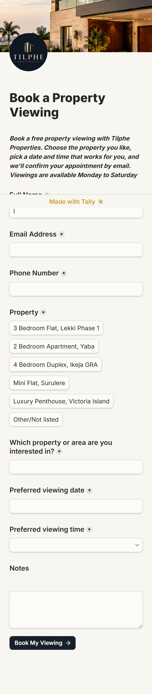
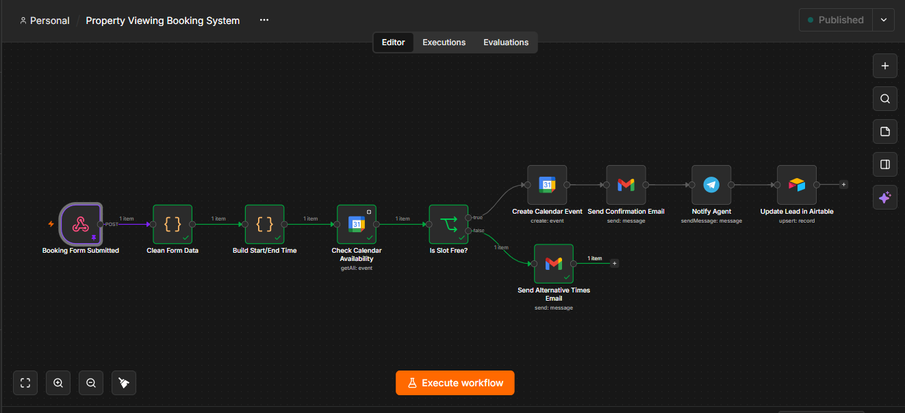
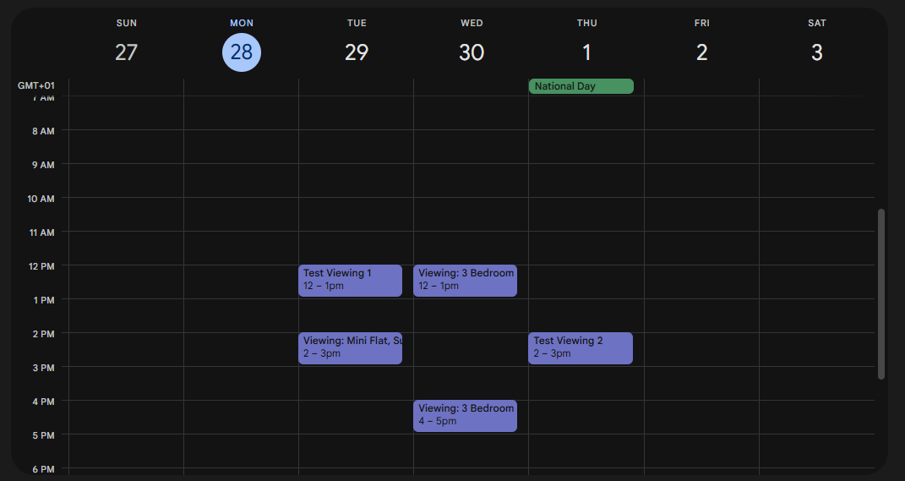
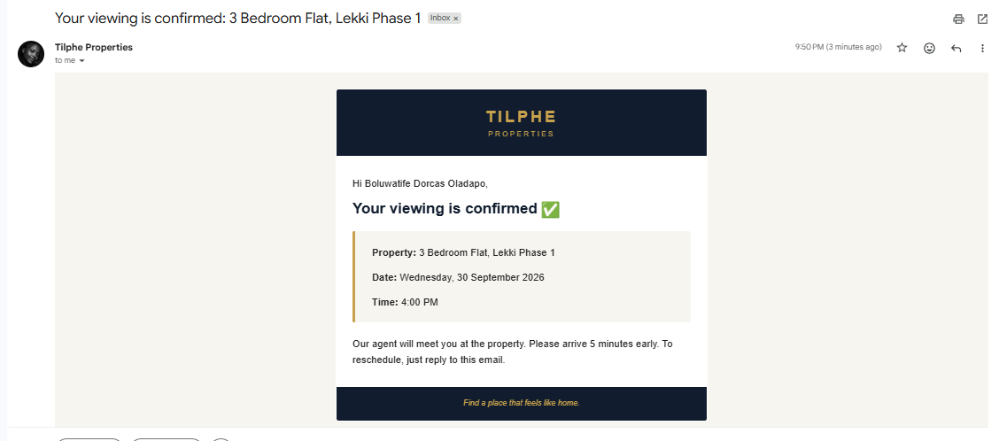
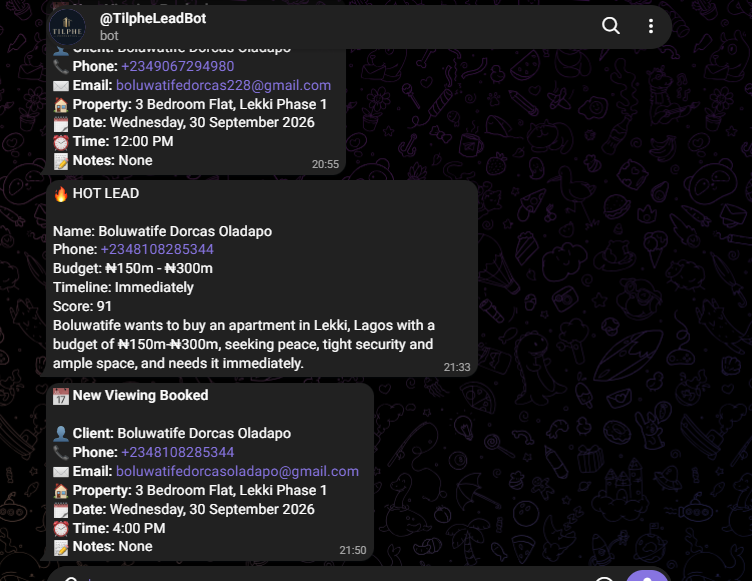
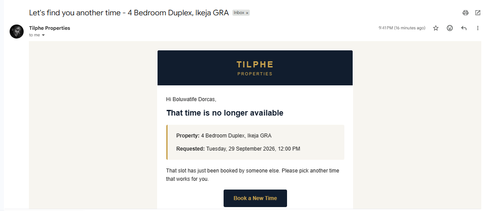

# AI Property Viewing Booking System

An automated workflow that lets real estate clients book a property viewing, checks live availability on Google Calendar, confirms the appointment by email, and alerts the agent — all without a single phone call.

This project is the second stage of a full real estate automation pipeline. It connects directly to my [AI Real Estate Lead Capture & Qualification System](https://github.com/Tilphee/ai-real-estate-lead-qualification): once a lead is qualified as Hot, they receive a "Book Your Viewing" link in their confirmation email, which leads straight into this system.

**Demo brand:** Tilphe Properties (fictional, built for portfolio purposes)

---

## The Problem

Booking a property viewing is usually manual: a client calls or messages an agent, the agent checks their calendar (or forgets to), times get mixed up, and busy leads slip through the cracks. There's no instant confirmation, no automatic record-keeping, and no way to know a slot is taken until it's too late.

## The Solution

A self-service booking form connected to an n8n workflow that:
- Checks Google Calendar in real time before confirming
- Books the slot instantly if it's free
- Offers the client another time if it's taken
- Notifies the agent on Telegram immediately
- Updates the client's lead record in Airtable automatically

## How It Works

```
Booking Form Submitted
        │
        ▼
  Clean Form Data
        │
        ▼
Build Start/End Time
        │
        ▼
Check Calendar Availability
        │
        ▼
   Is Slot Free?
   ┌────┴────┐
  Yes         No
   │           │
   ▼           ▼
Create Calendar Event   Send Alternative Times Email
   │
   ▼
Send Confirmation Email
   │
   ▼
Notify Agent (Telegram)
   │
   ▼
Update Lead in Airtable
```

**Tech stack:** n8n, Tally Forms, Google Calendar, Gmail, Telegram, Airtable

### Step by step

1. **Booking Form Submitted** — a client fills out the Tally form: name, email, phone, property, preferred date and time.
2. **Clean Form Data** — a Code node parses Tally's raw payload into a clean object.
3. **Build Start/End Time** — converts the date and time into a proper ISO timestamp, in the correct time zone (Africa/Lagos).
4. **Check Calendar Availability** — queries Google Calendar for existing events in that exact time slot.
5. **Is Slot Free?** — branches the workflow based on whether an event already exists.
   - **Free:** creates the calendar event, sends a branded confirmation email, alerts the agent on Telegram, and updates the lead's record in Airtable with the booking details.
   - **Taken:** sends the client a branded email letting them know the slot is gone and inviting them to pick another time.
6. **Update Lead in Airtable** — the same lead record created during qualification is updated (not duplicated) with booking status, property, and viewing date/time, matched by email. The lead's original Hot/Warm/Cold score is preserved.

An **error workflow** is connected to catch and report any node failure, so a broken email or API call doesn't leave a client stranded.

## Screenshots

| Booking Form | Workflow Canvas |
|---|---|
|  |  |

| Calendar Event | Confirmation Email |
|---|---|
|  |  |

| Telegram Alert | Alternative Times Email |
|---|---|
|  |  |

## Testing

The workflow was tested end to end for both branches:
- **Free slot:** booking confirmed, calendar event created, branded email sent, Telegram alert received, Airtable updated correctly.
- **Busy slot:** existing calendar event correctly detected, client received the "pick another time" email instead of a false confirmation.
- **Full pipeline:** a test enquiry was qualified as Hot, the resulting email included the booking link, and the booking flowed through to a confirmed viewing on the same lead record.

## What This Demonstrates

- Working with AI/automation tools (n8n) to build real business logic, not just simple triggers
- Real-time availability checking (avoiding double bookings)
- Branded, professional client communication (HTML email design)
- Multi-channel notifications (email + Telegram)
- Data consistency across a pipeline (Airtable record updates, not duplicates)
- Error handling for production-readiness

## Related Project

This system is stage two of a two-part pipeline. Stage one qualifies and scores incoming leads:
👉 [AI Real Estate Lead Capture & Qualification System](https://github.com/Tilphee/ai-real-estate-lead-qualification)

Together: **Enquiry → Qualified → Hot Email with Booking Link → Booking → Calendar → Confirmation → Agent Notified → Lead Record Updated**

---

*Built by Boluwatife "Tiphe" — AI Automation Specialist*
